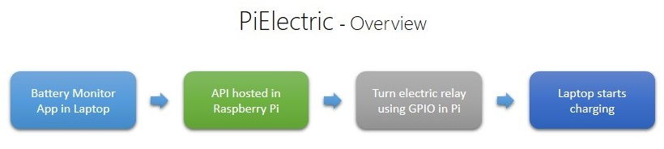
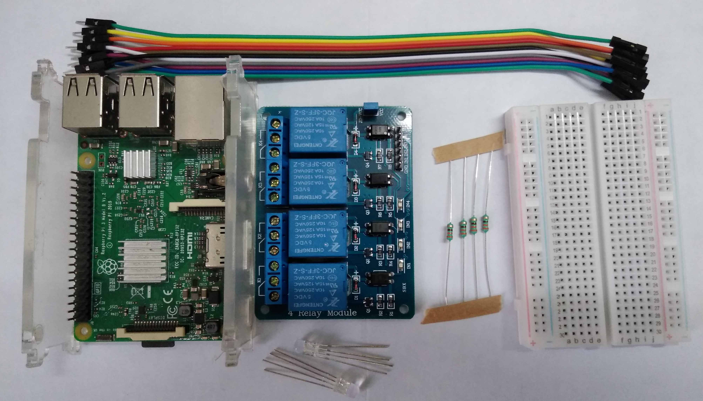
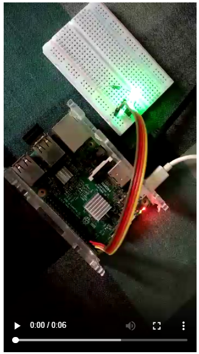
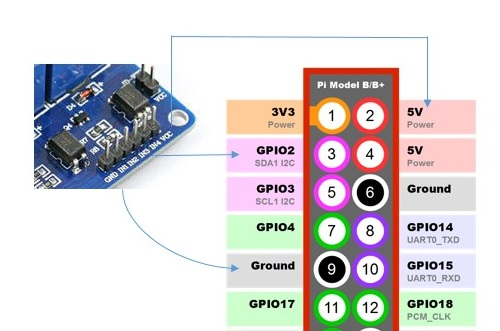
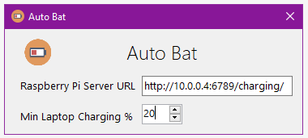
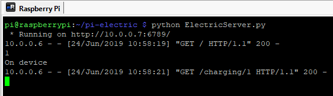
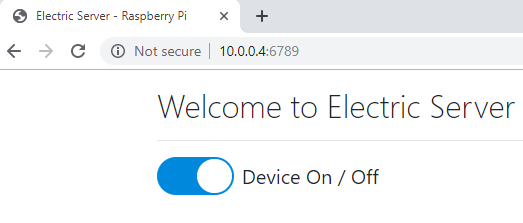
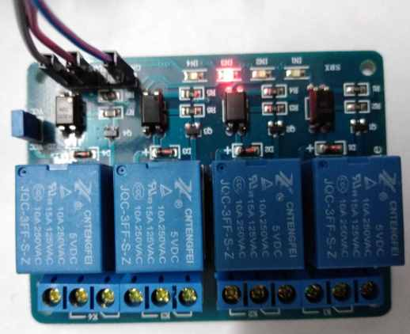

# ElectricPi

To control an electic device via a relay, through Raspberry Pi, which has the API and will be triggered by a battery monitor app in laptop.

Using this solution, we can power On or Off an electric device (such as a laptop charger) at a desired time (a low battery in laptop) 

## Introduction

  

As shown in the above image, this solution contains four key phases:

1. One battery monitor app will be running in the laptop and triggers an API call hosted in Raspberry Pi device.
1. The request from the battery monitor app contains either to On or Off flag. Raspberry Pi will trigger the relay accordingly.
1. The relay is connected to GPIO pins of Raspberry Pi. The laptop charger will be turned On or Off via the realy.
1. After the charger is On, as the battery monitor app in laptop is running, it will monitor battery percentage and sends an Off signal to Raspberry Pi
   
## Hardware

  

Below electronic components are used in this solution:

1. Raspberry Pi - 1No
2. Relay circuit - 1No
3. LED - 1No (optional)
4. 330Ω resistor - 1No(optional)
5. Connecting wires
    
## Working  Of Hardware

One key point in turning On and Off the devices is, we have to consider the polarity of the device. Some devices will work for common positive voltage and some will be for common negative.

*Working of a common anode LED.*

### Connecting The Components

The below image shows the mapping of pins between the relay and Raspberry Pi GPIO pins

1. GND pin of relay is connected to one of the ground pins of Pi.
2. VCC pin of relay is connected to one of the +5V pin of the Pi.
3. To trigger the relay, GPIO pin 2 is used and connected to one of the IN pins of relay.

## Software

The software consists of two parts:

1. Battery monitoring app in Laptop - Implemented in **C#.**
2. Web API solution which will listen for requests to turn device On and Off - Implemented in **Python.**

### AutoBat - Battery charging monitoring client in Laptop  

This app is implemented in C#. While this app is running in laptop, it will verify the battery charging percentage for every few seconds and sends request to the Pi server to switch On or Off the charger.

*Battery monitoring client* 

*Pi Server*

*Optional Web UI*

## Working Of The Solution
When the laptop battery has low charging, the AutoBat application will send a web request to the Raspberry Pi server which will trigger the charger via realy. After sufficient charging, again the charger will be turned off via relay based on the request from AutoBat app from laptop.

 

*Triggering of Realy*

